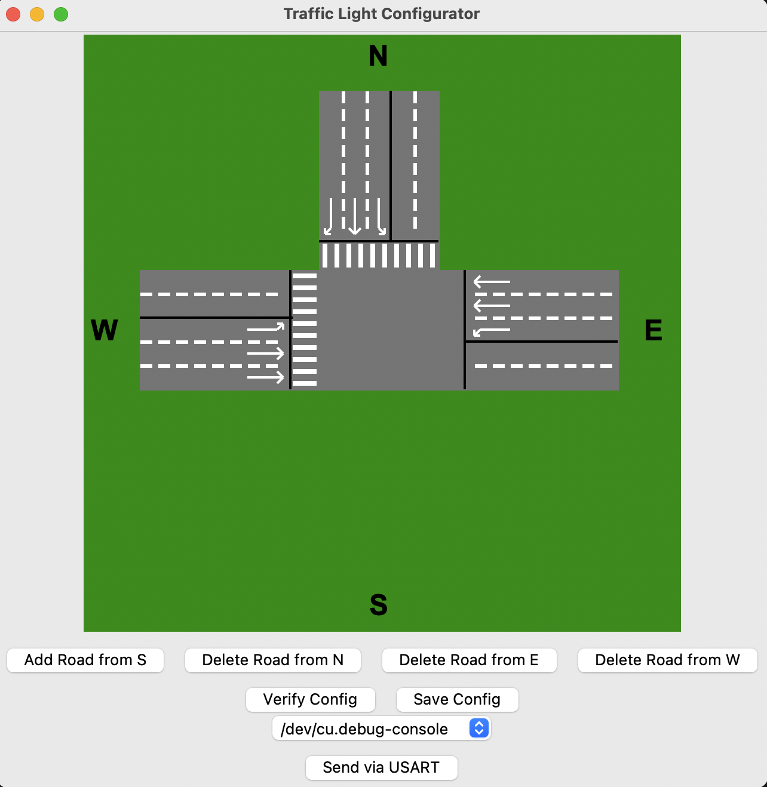

# Crossroad Lights

## Description
This project simulates a traffic light system at a crossroad. It's divided int two main components:
1. [**Configurator**](CrossRoadConfig/): A Python GUI application that allows users to configure the traffic lights.
2. [**Lights**](Lights/): Program for Atmega328PB that controls the traffic lights based on the configuration set in the configurator.

### Configurator

The configurator is a Python application that provides a graphical interface for users to set the timing and behavior of the traffic lights. It allows users to define the shape of the crossroad and the duration of each light (red, yellow, green). Interface looks like this:

Configuration is sent via serial port to the microcontroller. You can select the serial port in the configurator settings. The configurator also allows you to save the configuration to a file.

### Lights

The lights program is written in C++ with low-level parts in assembly. It runs on an Atmega328PB microcontroller and controls the traffic lights based on the configuration received from the configurator. The program handles the timing of each light and ensures that the traffic lights operate in a safe and efficient manner. You can find more about the details in the [documentation file](docs/documentation.md)(only in Slovak).

Prove of concept was created as a part of semester project. It used Atmega328PB microcontroller and was tested with 4 port expanders MCP23017. The lights are connected to the microcontroller via I2C bus. The configurator sends the configuration to the microcontroller via serial port, and the microcontroller controls the lights based on the configuration.

